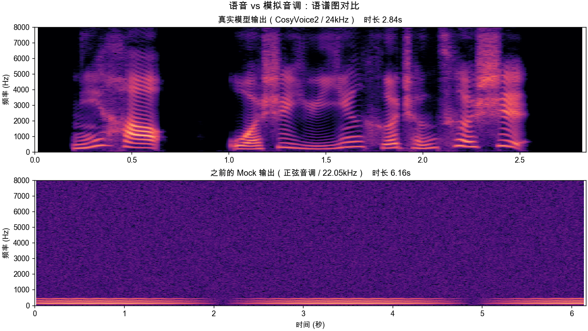

# CosyVoice Web 语音合成控制台

基于 [CosyVoice](https://github.com/QwenAudio/CosyVoice)（通义 / FunAudioLLM 开源语音大模型）构建的
**前后端分离**语音合成应用：

* **前端**：Vue 3 + Vite + TypeScript + Pinia（`frontend/`）
* **后端**：Python + FastAPI（`backend/`）
* **推理**：官方 CosyVoice 仓库（`AutoModel`），支持 CosyVoice 1.0 / 2.0 / 3.0

```
┌────────────────────────────┐        ┌──────────────────────────────┐
│  Vue 3 前端 (5173)          │        │  FastAPI 后端 (8000)          │
│  · 合成工作台                │  HTTP  │  · /api/v1/tts/*  合成接口     │
│  · 音色库 / 录音 / 上传       │ ─────► │  · /api/v1/voices/* 音色库     │
│  · Web Audio 流式播放        │ ◄───── │  · /api/v1/system/* 模型管理   │
└────────────────────────────┘  PCM   └───────────────┬──────────────┘
                                                      │
                                       ┌──────────────▼──────────────┐
                                       │ CosyVoice 官方推理运行时      │
                                       │ AutoModel / torch / onnx     │
                                       └──────────────────────────────┘
```

---

## 功能特性

| 能力 | 说明 |
| --- | --- |
| 预训练音色（SFT） | 使用模型内置说话人，输入文本即可合成 |
| 3s 极速复刻（zero-shot） | 上传/录制 3~30 秒参考音频 + 参考文本，复刻任意音色 |
| 跨语种复刻（cross-lingual） | 仅需参考音频，无需参考文本，支持中英日韩等 9 种语言互转 |
| 自然语言控制（instruct） | 「用四川话说这句话」「用开心的语气朗读」等方言/情感/语速控制 |
| 音色转换（VC） | 将源音频的音色转换为目标参考音频音色（CosyVoice 1.0） |
| 流式合成 | 后端逐块输出 PCM，前端 Web Audio 边收边播，首包延迟显著降低 |
| 音色库 | 参考音频 + 参考文本持久化管理，一键注册进推理运行时 |
| 录音与转码 | 浏览器直接录音，自动转码为 16kHz 单声道 WAV 后上传 |
| 失败即报错 | 模型加载失败会如实返回错误与原因，不存在任何"假音频"兜底路径 |

---

## 环境要求

* Python ≥ 3.10
* Node.js ≥ 18（推荐 20/22）
* 真实推理需要：CUDA GPU（CPU 也可运行，但速度较慢）
* 磁盘：模型权重约 1~3 GB

> **macOS 用户注意**：Apple Silicon 与 Intel Mac 都只能走 CPU 推理；
> Intel Mac 的 PyTorch 最高支持到 2.2.2。请使用 `bash scripts/install_cosyvoice_deps.sh`
> 安装依赖，详见文末「依赖安装排错」。

---

## 快速开始

### 方式一：接入模型并启动

```bash
# 1) 克隆 CosyVoice 官方仓库 + 子模块 + 下载权重（默认 CosyVoice2-0.5B）
bash scripts/setup_cosyvoice.sh

# 2) 安装后端依赖 + CosyVoice 推理依赖
#    该脚本会自动处理平台差异（macOS/Intel 的 torch 版本、whisper 源码构建等）
bash scripts/install_cosyvoice_deps.sh

# 3) 配置（复制后按需修改）
cp .env.example .env
#   CV_COSYVOICE_REPO=../CosyVoice
#   CV_MODEL_DIR=../CosyVoice/pretrained_models/CosyVoice2-0.5B
#   CV_PRELOAD_MODEL=true

# 4) 启动
.venv/bin/uvicorn app.main:app --port 8000
```

其他可用模型（`MODEL_ID` 传给 setup 脚本即可）：

```bash
MODEL_ID=iic/CosyVoice-300M-Instruct      bash scripts/setup_cosyvoice.sh   # 自然语言控制(1.0)
MODEL_ID=iic/CosyVoice-300M               bash scripts/setup_cosyvoice.sh   # 音色转换
MODEL_ID=FunAudioLLM/Fun-CosyVoice3-0.5B-2512 bash scripts/setup_cosyvoice.sh
```

> 也可以在 `backend/.env` 中直接把 `CV_MODEL_DIR` 写成 ModelScope 仓库 id（如 `iic/CosyVoice2-0.5B`），
> 后端启动时会自动 `snapshot_download` 下载权重。

### 方式二：Makefile 快捷命令

```bash
make setup        # 安装前后端依赖（Web 层）
make deps         # 安装后端 + CosyVoice 推理依赖
make api          # 启动后端
make web          # 启动前端
make model        # 克隆 CosyVoice 并下载模型
make build        # 构建前端生产包
make test         # 运行后端测试
```

---

## 目录结构

```
cosyVoice-test/
├── backend/                     # FastAPI 后端
│   ├── app/
│   │   ├── main.py              # 应用入口（CORS / 生命周期 / 路由挂载）
│   │   ├── config.py            # 配置（CV_ 前缀环境变量）
│   │   ├── schemas.py           # 请求/响应模型（驱动 OpenAPI 文档）
│   │   ├── api/                 # health / system / voices / tts 路由
│   │   ├── core/
│   │   │   ├── model_manager.py      # 模型生命周期 + 推理串行化
│   │   │   └── cosyvoice_backend.py  # 官方 AutoModel 封装
│   │   ├── services/
│   │   │   ├── modes.py         # 合成模式元数据（前后端共用契约）
│   │   │   ├── tts_service.py   # 参数校验 / 合成 / 落盘
│   │   │   └── voice_store.py   # 自定义音色库（文件存储）
│   │   └── utils/audio.py       # WAV 读写与校验
│   ├── tests/                   # pytest 接口测试（HTTP 层用测试桩，无需 GPU）
│   ├── requirements.txt
│   └── Dockerfile
├── frontend/                    # Vue 3 前端
│   └── src/
│       ├── api/                 # axios 封装 + 流式 fetch
│       ├── components/          # 音频输入 / 播放器 / 模式切换 / 结果卡片
│       ├── composables/         # 录音、PCM 流式播放、Toast
│       ├── stores/              # Pinia：设置 / 系统状态 / 音色库 / 历史
│       ├── views/               # 合成 / 音色库 / 记录 / 设置
│       └── utils/audio.ts       # 浏览器端 WAV 编解码与重采样
├── scripts/setup_cosyvoice.sh   # 克隆官方仓库并下载权重
└── Makefile
```

---

## 接口速览

启动后访问 <http://localhost:8000/docs> 查看完整交互式文档。

| 方法 | 路径 | 说明 |
| --- | --- | --- |
| GET | `/api/v1/health` | 健康检查 |
| GET | `/api/v1/system/info` | 服务信息、模型状态、内置音色、限制项 |
| GET | `/api/v1/system/modes` | 可用合成模式及其字段定义 |
| POST | `/api/v1/system/load` | 加载模型（可 `?force=true` 重载） |
| POST | `/api/v1/system/unload` | 卸载模型并释放显存 |
| GET | `/api/v1/voices` | 自定义音色列表 |
| POST | `/api/v1/voices` | 新建音色（multipart 上传参考音频） |
| PATCH | `/api/v1/voices/{id}` | 更新音色信息 |
| POST | `/api/v1/voices/{id}/register` | 注册到推理运行时 |
| DELETE | `/api/v1/voices/{id}` | 删除音色 |
| POST | `/api/v1/tts/synthesize` | 一次性合成，返回完整 WAV |
| POST | `/api/v1/tts/stream` | 流式合成，返回 int16 PCM 分片 |
| GET | `/api/v1/tts/history` | 最近生成记录 |
| GET | `/api/v1/tts/audio/{id}` | 下载/播放某个生成结果 |

### 流式协议

`POST /api/v1/tts/stream` 使用 `application/octet-stream` 返回 16bit 小端 PCM，
响应头携带元信息：

```
X-Audio-Id: a78950af262441e2      # 可用于拼接 /api/v1/tts/audio/{id}
X-Sample-Rate: 22050
X-Channels: 1
X-Sample-Format: int16
```

前端 `usePcmStreamPlayer` 会把分片解码后依次排进 Web Audio 时间轴，实现边收边播，
并在结束后合并为 WAV 供下载。

---

## 配置项

后端所有配置都以 `CV_` 为前缀（`backend/.env` 或环境变量），常用项：

| 变量 | 默认值 | 说明 |
| --- | --- | --- |
| `CV_HOST` / `CV_PORT` | `0.0.0.0` / `8000` | 监听地址与端口 |
| `CV_CORS_ORIGINS` | `["http://localhost:5173"]` | 允许跨域的前端地址（JSON 数组） |
| `CV_COSYVOICE_REPO` | `../CosyVoice` | CosyVoice 官方仓库路径 |
| `CV_MODEL_DIR` | `iic/CosyVoice2-0.5B` | 本地模型目录或 ModelScope 仓库 id |
| `CV_PRELOAD_MODEL` | `false` | 启动时立即加载模型 |
| `CV_FP16` / `CV_LOAD_JIT` / `CV_LOAD_TRT` / `CV_LOAD_VLLM` | `false` | 推理加速开关（需 CUDA） |
| `CV_DATA_DIR` | `../data` | 音色库与生成结果目录 |
| `CV_MAX_UPLOAD_MB` | `30` | 参考音频大小上限 |
| `CV_MAX_PROMPT_SECONDS` | `30` | 参考音频时长上限 |

前端配置位于 `frontend/.env`：

| 变量 | 默认值 | 说明 |
| --- | --- | --- |
| `VITE_API_BASE_URL` | 空 | 后端地址；留空表示同源 / 使用 Vite 开发代理 |
| `VITE_API_PREFIX` | `/api/v1` | 接口前缀，需与后端一致 |
| `VITE_DEV_PROXY_TARGET` | `http://127.0.0.1:8000` | 仅开发环境的代理目标 |

---

## 常见问题

**Q：前端提示「无法连接后端服务」？**
确认后端已启动，且 `CV_PORT` 与前端配置一致；若前端不是通过 Vite 代理访问，需要在「设置」页把
API 地址改为 `http://<后端IP>:8000`，并保证该地址在后端 `CV_CORS_ORIGINS` 中。

**Q：为什么「预训练音色」模式一开始没有音色可选？**
预训练音色列表来自模型内部，模型未加载时为空。建议在 `.env` 中设置 `CV_PRELOAD_MODEL=true`，
或先点击「设置 → 加载模型」。

**Q：首次合成非常慢？**
真实模型加载需要数十秒到数分钟，属于正常现象。加载完成后后续请求会复用同一份模型。

**Q：录音上传后合成失败？**
浏览器录音通常是 `webm/opus`，TorchAudio 无法直接读取。本项目已在前端统一转码为
16kHz 单声道 WAV（`frontend/src/utils/audio.ts`），若仍有问题请检查浏览器是否支持
Web Audio API。

**Q：想换成 CosyVoice 3.0？**
把 `CV_MODEL_DIR` 指向 Fun-CosyVoice3 权重目录（或 ModelScope id）即可，后端会自动识别
`cosyvoice3.yaml` 并切换对应的推理类。

**Q：合成报错「模型尚未加载 / 模型加载失败」，或接口返回 503？**

这是**预期行为**：本项目没有任何模拟推理路径，模型不可用时一律如实报错，
不会返回"听起来像音频但不是人声"的内容。排查步骤：

```bash
curl -s http://127.0.0.1:8000/api/v1/system/info | python3 -m json.tool
# 关注 model.state / model.error / model.model_dir
```

最常见的三种原因：

| 现象 | 原因 | 修复 |
| --- | --- | --- |
| `本地模型目录不存在: ...` | 权重没下载 | `bash scripts/setup_cosyvoice.sh` |
| `无法导入 cosyvoice 包` | 未克隆官方仓库或未装推理依赖 | `bash scripts/setup_cosyvoice.sh` + `bash scripts/install_cosyvoice_deps.sh` |
| `ModelScope 下载失败` | 网络问题 | 配好镜像或改为本地权重路径 |

界面在 `state=error` 时会显示红色错误条并给出后端返回的具体原因；
「设置」页也可以手动点「加载模型」重试。

启动日志里出现 `no frontend is avaliable` 或
`modelscope - ERROR - Authentication token does not exist` 是**非致命**的：
前者表示文本正则化模型（WeTextProcessing）没能下载，此时数字/符号不会被规范化，
其余功能不受影响。想启用的话，登录 ModelScope 或配好镜像后重启即可。

### 如何确认拿到的是人声

真实模型与"模拟音调"在语谱图上的差别非常直观 —— 人声有谐波堆叠与共振峰走向，
音调只是一条水平亮线：



定量判据：真实语音的显著谱峰通常在 **1000 个以上**，而单一音调只有十几个。
把生成的 wav 路径传给下面这段脚本即可判断：

```bash
cd backend && .venv/bin/python check_audio.py data/outputs/xxx.wav
```

---

## 依赖安装排错（macOS / 无 GPU）

直接执行 `pip install -r CosyVoice/requirements.txt` 在 macOS 上几乎一定会失败，
本项目提供了平台自适应的替代方案：

```bash
bash scripts/install_cosyvoice_deps.sh     # 等价于：make deps
```

它做了三件事，对应三个典型报错：

| 报错 | 原因 | 处理方式 |
| --- | --- | --- |
| `Failed to build 'openai-whisper'`<br>`ModuleNotFoundError: No module named 'pkg_resources'` | setuptools ≥ 81 移除了 `pkg_resources`，而 whisper 的 `setup.py` 仍依赖它；whisper 只提供 sdist，必须现场构建 | 用 `--build-constraint`（pip ≥ 25.1）把**构建隔离环境**里的 setuptools 约束到 `<81`；旧版 pip 则回退到 `--no-build-isolation` |
| `No matching distribution found for torch==2.3.1` | PyTorch 从 2.3 起不再发布 macOS **x86_64（Intel）** 轮子，2.2.2 是最后一个可用版本 | `backend/requirements-cosyvoice.txt` 里按 `sys_platform` + `platform_machine` 自动选版本 |
| `pyworld` / `deepspeed` 编译失败 | 二者只在训练与数据预处理链路中使用，推理时不会被 import，且只有源码包 | 已从推理依赖中移除，需要训练时再单独安装官方全量依赖 |

> 注意：`PIP_CONSTRAINT` 环境变量对 PEP 517 **构建隔离环境**不生效，必须用 pip 的
> `--build-constraint` 选项（或关闭构建隔离），这是很多人踩过的坑。

### 依赖裁剪的判定方式

`backend/requirements-cosyvoice.txt` 并不等同于官方 `CosyVoice/requirements.txt`，
裁剪时**不能凭"看起来像训练依赖"就删**。判断依据是：用 AST 扫描
`CosyVoice/cosyvoice` 与 `CosyVoice/third_party/Matcha-TTS` 的全部 import，
再逐条确认是否落在推理链路上。踩过的坑：

| 包 | 看起来像 | 实际 |
| --- | --- | --- |
| `conformer` / `diffusers` | 训练用 | `third_party/Matcha-TTS/matcha/models/components/decoder.py` 顶层 import，**推理必需** |
| `rich` / `lightning` / `gdown` / `matplotlib` / `wget` | 训练工具链 | `matcha/utils/__init__.py` 连带导入，**推理必需** |
| `pyarrow` / `pyworld` | 数据处理 | `cosyvoice2.yaml` 含 data_pipeline 段，hyperpyyaml 加载模型时会**急切解析** `dataset/processor.py` 的每个 callable，**推理必需** |
| `deepspeed` | 训练 | 仅 `bin/train.py`、`utils/train_utils.py`，可安全移除 |
| `tensorboard` / `grpcio` / `gradio` / `tensorrt-*` | 工具 / 服务 | 不在推理 import 链路，可移除 |

还有个容易忽略的点：**setuptools 必须 <81**。`setuptools>=81` 移除了 `pkg_resources`，
而 `lightning 2.2.4` 在运行期仍然 import 它（构建 `openai-whisper` 时也需要）。
所以安装脚本里是 `pip install "setuptools<81"`，而不是 `pip install -U setuptools`。

### 上游 API 差异（容易踩的坑）

`CosyVoice/runtime/python/fastapi/server.py` **已经过时**，不要照抄：

```python
# ❌ 上游 server.py 的旧写法：先把参考音频读成 tensor
prompt_speech_16k = load_wav(prompt_wav.file, 16000)
cosyvoice.inference_zero_shot(tts_text, prompt_text, prompt_speech_16k)

# ✅ 当前版本：直接传文件路径
cosyvoice.inference_zero_shot(tts_text, prompt_text, './asset/zero_shot_prompt.wav')
```

原因是当前 `CosyVoiceFrontEnd` 会在 `_extract_speech_feat`(24kHz)、
`_extract_speech_token`(16kHz)、`_extract_spk_embedding`(16kHz) 里**各自重新读取一次文件**
并按不同目标采样率重采样，传入 tensor 会抛 `TypeError: Invalid file: tensor(...)`。
`backend/app/core/cosyvoice_backend.py` 的 `_prompt_path()` 已按新用法实现，
并有回归测试锁定（`backend/tests/test_backend_contract.py`）。

**性能预期**：macOS 只能走 CPU 推理（Apple Silicon 也一样）。CosyVoice2-0.5B 在
i7-7700HQ 上 RTF≈100，仅适合功能验证；生产使用建议放在 Linux + CUDA 机器上，
或使用仓库根目录的 `docker-compose.yml` 以 linux/amd64 容器运行。


---

## 开发与测试

```bash
# 后端测试（HTTP 层使用 tests/stub_backend.py 测试桩，无需 GPU 与权重）
cd backend && .venv/bin/python -m pytest -q

# 前端类型检查 + 构建
cd frontend && npm run build
```

## 许可证与致谢

* CosyVoice 官方项目：<https://github.com/QwenAudio/CosyVoice>（Apache-2.0）
* 本项目仅做工程化封装，模型版权与使用条款请遵循上游说明；请勿将合成音频用于违法用途，
  使用他人声音前需获得明确授权。
